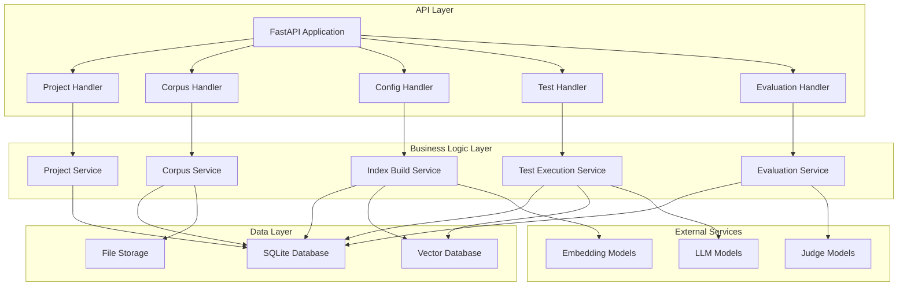
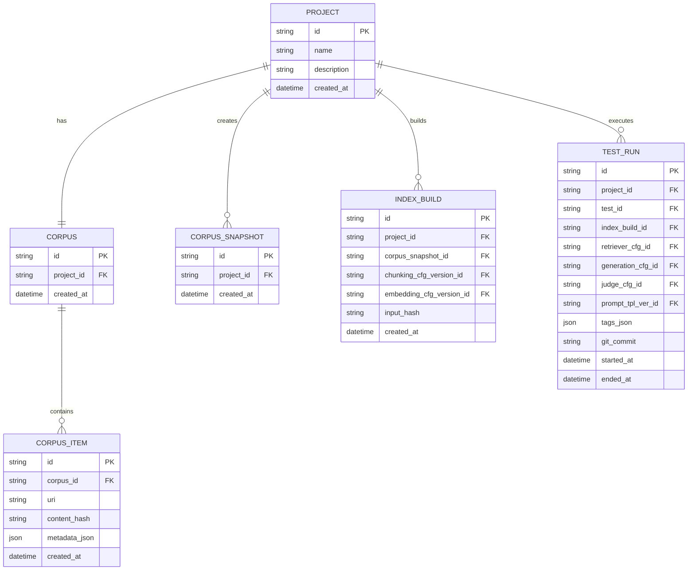

# RAG Evaluation Backend System Design

## Overview

The RAG Evaluation Backend is a comprehensive system for evaluating Retrieval-Augmented Generation (RAG) applications through systematic testing, configuration management, and performance analysis. The system enables researchers and developers to conduct reproducible experiments with different chunking strategies, embedding models, retrieval configurations, and generation parameters.

### Core Capabilities
- **Versioned Configuration Management**: Immutable configurations for chunking, embedding, retrieval, generation, and evaluation
- **Corpus Management**: File ingestion, processing, and snapshot creation for reproducible testing
- **Index Building**: Automated chunking and embedding with caching and reuse
- **Test Execution**: Parallel test runs with comprehensive logging and traceability
- **Evaluation Framework**: LLM-as-judge scoring with human review capabilities
- **Performance Analytics**: KPI aggregation, cost tracking, and comparative analysis

### Repository Type
This is a **Backend Application** built with FastAPI, providing REST APIs for RAG evaluation workflows.

## Architecture

### System Architecture



### Data Model Architecture



## API Endpoints Reference

### Project Management

| Method | Endpoint | Description | Request Body | Response |
|--------|----------|-------------|--------------|----------|
| POST | `/projects` | Create new project | `ProjectCreate` | `ProjectResponse` |
| GET | `/projects` | List all projects | - | `List[ProjectResponse]` |
| GET | `/projects/{id}` | Get project details | - | `ProjectResponse` |
| PUT | `/projects/{id}` | Update project | `ProjectUpdate` | `ProjectResponse` |
| DELETE | `/projects/{id}` | Delete project | - | `204 No Content` |

### Corpus Management

| Method | Endpoint | Description | Request Body | Response |
|--------|----------|-------------|--------------|----------|
| POST | `/projects/{id}/corpus/items` | Add corpus item | `CorpusItemCreate` | `CorpusItemResponse` |
| GET | `/projects/{id}/corpus/items` | List corpus items | - | `List[CorpusItemResponse]` |
| DELETE | `/corpus/items/{id}` | Remove corpus item | - | `204 No Content` |
| POST | `/projects/{id}/corpus/snapshots` | Create snapshot | `SnapshotCreate` | `SnapshotResponse` |

### Configuration Management

| Method | Endpoint | Description | Request Body | Response |
|--------|----------|-------------|--------------|----------|
| POST | `/projects/{id}/configs/chunking` | Create chunking config | `ChunkingConfigCreate` | `ChunkingConfigResponse` |
| POST | `/projects/{id}/configs/embedding` | Create embedding config | `EmbeddingConfigCreate` | `EmbeddingConfigResponse` |
| POST | `/projects/{id}/configs/retriever` | Create retriever config | `RetrieverConfigCreate` | `RetrieverConfigResponse` |
| POST | `/projects/{id}/configs/generation` | Create generation config | `GenerationConfigCreate` | `GenerationConfigResponse` |
| POST | `/projects/{id}/configs/judge` | Create judge config | `JudgeConfigCreate` | `JudgeConfigResponse` |
| POST | `/projects/{id}/configs/prompt` | Create prompt template | `PromptTemplateCreate` | `PromptTemplateResponse` |

### Index Building

| Method | Endpoint | Description | Request Body | Response |
|--------|----------|-------------|--------------|----------|
| POST | `/projects/{id}/index-builds` | Create index build | `IndexBuildCreate` | `IndexBuildResponse` |
| GET | `/projects/{id}/index-builds` | List index builds | - | `List[IndexBuildResponse]` |
| GET | `/index-builds/{id}/chunks` | Get chunks from build | - | `List[ChunkResponse]` |

### Enhanced Test Management

| Method | Endpoint | Description | Request Body | Response |
|--------|----------|-------------|--------------|----------|
| POST | `/projects/{id}/tests` | Create test suite | `TestCreate` | `TestResponse` |
| POST | `/tests/{id}/questions` | Add questions to test | `List[QuestionCreate]` | `List[QuestionResponse]` |
| POST | `/tests/{id}/runs` | Execute test run | `TestRunCreate` | `TestRunResponse` |
| POST | `/tests/{id}/matrix-runs` | Execute matrix experiment | `MatrixExperimentCreate` | `MatrixExperimentResponse` |
| GET | `/test-runs/{id}` | Get run details | - | `TestRunDetailResponse` |
| GET | `/test-runs/{id}/results` | Get comprehensive results | - | `TestRunResultsResponse` |
| GET | `/test-runs/{id}/costs` | Get cost breakdown | - | `CostBreakdownResponse` |
| POST | `/test-runs/{id}/compare` | Compare with other runs | `CompareRunsRequest` | `RunComparisonResponse` |

### Human Review and Override

| Method | Endpoint | Description | Request Body | Response |
|--------|----------|-------------|--------------|----------|
| POST | `/run-questions/{id}/reviews` | Submit human review | `HumanReviewCreate` | `HumanReviewResponse` |
| GET | `/run-questions/{id}/reviews` | Get review history | - | `List[HumanReviewResponse]` |
| PUT | `/evaluations/{id}/override` | Override evaluation score | `EvaluationOverride` | `EvaluationResponse` |
| GET | `/projects/{id}/reviews/pending` | Get pending reviews | - | `List[PendingReviewResponse]` |

### Enhanced Results API Response Models

```python
class TestRunResultsResponse(BaseModel):
    """Comprehensive test run results with full traceability"""
    run_metadata: TestRunMetadata
    questions: List[QuestionResult]
    aggregated_metrics: Dict[str, float]
    cost_breakdown: CostBreakdown
    performance_stats: PerformanceStats

class QuestionResult(BaseModel):
    """Complete result for a single question"""
    question: QuestionResponse
    run_question_id: str
    retrieval_results: RetrievalResults
    prompt_instance: PromptInstanceResponse
    llm_calls: List[LLMCallResponse]
    answer: AnswerResponse
    evaluations: List[EvaluationResponse]
    human_reviews: List[HumanReviewResponse]
    retrieval_metrics: Dict[str, float]
    final_scores: Dict[str, float]  # After human review overrides

class RetrievalResults(BaseModel):
    """Detailed retrieval results with chunk information"""
    retrieved_chunks: List[RetrievedChunkDetail]
    total_chunks: int
    retrieval_time_ms: int
    
class RetrievedChunkDetail(BaseModel):
    """Complete chunk information for traceability"""
    chunk_id: str
    rank: int
    score: float
    document_id: str
    document_title: str
    span_start: int
    span_end: int
    text: str
    metadata: Dict[str, Any]
    is_relevant: Optional[bool]  # Based on golden answers

class PromptInstanceResponse(BaseModel):
    """Rendered prompt with variables"""
    id: str
    template_version_id: str
    rendered_text: str
    variables: Dict[str, Any]
    content_hash: str
    created_at: datetime

class RunComparisonResponse(BaseModel):
    """Comparison between multiple test runs"""
    runs: List[TestRunSummary]
    metric_comparisons: Dict[str, MetricComparison]
    configuration_diff: ConfigurationDiff
    statistical_significance: Dict[str, SignificanceTest]
    recommendations: List[str]

class MetricComparison(BaseModel):
    """Comparison of a specific metric across runs"""
    metric_name: str
    values: Dict[str, float]  # run_id -> value
    best_run_id: str
    improvement_percentage: float
    confidence_interval: Tuple[float, float]

class CostBreakdownResponse(BaseModel):
    """Detailed cost analysis"""
    total_cost: float
    cost_by_model: Dict[str, ModelCost]
    cost_by_operation: Dict[str, float]  # embedding, generation, evaluation
    token_usage: TokenUsage
    cost_per_question: float
    projected_monthly_cost: float

class ModelCost(BaseModel):
    model_name: str
    prompt_tokens: int
    completion_tokens: int
    total_calls: int
    total_cost: float
    average_cost_per_call: float
```

### Authentication Requirements
- All endpoints require project-level access control
- API key authentication for external model calls
- Rate limiting for resource-intensive operations

## Data Models & ORM Mapping

### Enhanced Database Schema with Immutability

```sql
-- Core schema with proper foreign key constraints
PRAGMA foreign_keys = ON;

-- Index build with proper FK constraints
CREATE TABLE IF NOT EXISTS index_build (
  id                          TEXT PRIMARY KEY,
  project_id                  TEXT NOT NULL REFERENCES project(id) ON DELETE CASCADE,
  corpus_snapshot_id          TEXT NOT NULL REFERENCES corpus_snapshot(id) ON DELETE RESTRICT,
  chunking_cfg_version_id     TEXT NOT NULL REFERENCES chunking_config_version(id) ON DELETE RESTRICT,
  embedding_cfg_version_id    TEXT NOT NULL REFERENCES embedding_config_version(id) ON DELETE RESTRICT,
  vector_params_json          TEXT,
  input_hash                  TEXT NOT NULL,
  created_at                  TEXT DEFAULT CURRENT_TIMESTAMP
);
CREATE UNIQUE INDEX IF NOT EXISTS uq_index_build_input ON index_build(input_hash);

-- Enhanced prompt instance with proper FKs
CREATE TABLE IF NOT EXISTS prompt_instance (
  id                    TEXT PRIMARY KEY,
  test_run_id           TEXT NOT NULL REFERENCES test_run(id) ON DELETE CASCADE,
  run_question_id       TEXT NOT NULL REFERENCES run_question(id) ON DELETE CASCADE,
  template_version_id   TEXT NOT NULL REFERENCES prompt_template_version(id) ON DELETE RESTRICT,
  rendered_text         TEXT NOT NULL,
  variables_json        TEXT,
  content_hash          TEXT NOT NULL,
  created_at            TEXT DEFAULT CURRENT_TIMESTAMP
);

-- LLM pricing table for cost calculation
CREATE TABLE IF NOT EXISTS llm_pricing (
  id              TEXT PRIMARY KEY,
  model_name      TEXT NOT NULL UNIQUE,
  prompt_price    REAL NOT NULL,      -- $ per 1K tokens
  completion_price REAL NOT NULL,     -- $ per 1K tokens
  effective_date  TEXT NOT NULL,
  created_at      TEXT DEFAULT CURRENT_TIMESTAMP
);

-- Immutability enforcement triggers
CREATE TRIGGER IF NOT EXISTS trg_no_update_chunking_cfg
BEFORE UPDATE ON chunking_config_version
BEGIN
  SELECT RAISE(ABORT, 'chunking_config_version is immutable');
END;

CREATE TRIGGER IF NOT EXISTS trg_no_update_embedding_cfg
BEFORE UPDATE ON embedding_config_version
BEGIN
  SELECT RAISE(ABORT, 'embedding_config_version is immutable');
END;

CREATE TRIGGER IF NOT EXISTS trg_no_update_prompt_template
BEFORE UPDATE ON prompt_template_version
BEGIN
  SELECT RAISE(ABORT, 'prompt_template_version is immutable');
END;

CREATE TRIGGER IF NOT EXISTS trg_no_delete_snapshot
BEFORE DELETE ON corpus_snapshot
BEGIN
  SELECT RAISE(ABORT, 'corpus_snapshot is immutable');
END;

CREATE TRIGGER IF NOT EXISTS trg_no_update_index_build
BEFORE UPDATE ON index_build
BEGIN
  SELECT RAISE(ABORT, 'index_build is immutable');
END;

CREATE TRIGGER IF NOT EXISTS trg_no_update_test_run_finished
BEFORE UPDATE ON test_run
FOR EACH ROW
WHEN OLD.ended_at IS NOT NULL
BEGIN
  SELECT RAISE(ABORT, 'finished test_run is immutable');
END;
```

### Core Domain Models

```python
@dataclass
class Project:
    id: str
    name: str
    description: Optional[str]
    created_at: datetime

@dataclass
class CorpusItem:
    id: str
    corpus_id: str
    uri: str
    content_hash: str
    metadata: Dict[str, Any]
    created_at: datetime

@dataclass
class ChunkingConfigVersion:
    id: str
    project_id: str
    strategy: str  # "recursive", "semantic", "document"
    size: int
    overlap: int
    rules: Dict[str, Any]
    version_label: str
    created_at: datetime

@dataclass
class EmbeddingConfigVersion:
    id: str
    project_id: str
    model_name: str  # "text-embedding-3-small", "text-embedding-ada-002"
    dimensions: int
    normalize: bool
    params: Dict[str, Any]
    version_label: str
    created_at: datetime

@dataclass
class IndexBuild:
    id: str
    project_id: str
    corpus_snapshot_id: str
    chunking_cfg_version_id: str
    embedding_cfg_version_id: str
    input_hash: str
    created_at: datetime

@dataclass
class TestRun:
    id: str
    project_id: str
    test_id: str
    index_build_id: str
    retriever_cfg_id: str
    generation_cfg_id: str
    judge_cfg_id: str
    prompt_template_version_id: str
    tags: Dict[str, Any]
    git_commit: Optional[str]
    started_at: datetime
    ended_at: Optional[datetime]
```

### Repository Pattern Implementation

```python
class BaseRepo:
    def __init__(self, conn: sqlite3.Connection):
        self._conn = conn
    
    def execute(self, sql: str, params: tuple = None) -> None:
        self._conn.execute(sql, params)
        self._conn.commit()
    
    def fetch_one(self, sql: str, params: tuple = None) -> Optional[sqlite3.Row]:
        return self._conn.execute(sql, params).fetchone()
    
    def fetch_all(self, sql: str, params: tuple = None) -> List[sqlite3.Row]:
        return self._conn.execute(sql, params).fetchall()

class ProjectRepo(BaseRepo):
    def create_project(self, project: Project) -> None:
        self.execute(
            "INSERT INTO project (id, name, description) VALUES (?, ?, ?)",
            (project.id, project.name, project.description)
        )
    
    def get_project(self, project_id: str) -> Optional[Project]:
        row = self.fetch_one("SELECT * FROM project WHERE id = ?", (project_id,))
        return Project(**row) if row else None
```

## Business Logic Layer

### Project Management Service

```python
class ProjectService:
    def __init__(self, project_repo: ProjectRepo, corpus_repo: CorpusRepo):
        self.project_repo = project_repo
        self.corpus_repo = corpus_repo
    
    async def create_project(self, name: str, description: str = None) -> Project:
        project = Project(
            id=str(uuid.uuid4()),
            name=name,
            description=description,
            created_at=datetime.utcnow()
        )
        
        # Create project
        self.project_repo.create_project(project)
        
        # Create default corpus
        corpus = Corpus(
            id=str(uuid.uuid4()),
            project_id=project.id,
            created_at=datetime.utcnow()
        )
        self.corpus_repo.create_corpus(corpus)
        
        return project
```

### Enhanced Index Build Service with Proper Persistence

```python
class IndexBuildService:
    def __init__(self, 
                 index_build_repo: IndexBuildRepo,
                 chunker: Chunker,
                 embedding_service: EmbeddingService,
                 vector_db: VectorDatabase):
        self.index_build_repo = index_build_repo
        self.chunker = chunker
        self.embedding_service = embedding_service
        self.vector_db = vector_db
    
    async def create_index_build(self,
                               project_id: str,
                               corpus_snapshot_id: str,
                               chunking_config_id: str,
                               embedding_config_id: str,
                               vector_params: Dict[str, Any] = None) -> IndexBuild:
        
        # Include vector params in hash computation
        input_hash = self._compute_input_hash(
            corpus_snapshot_id, 
            chunking_config_id, 
            embedding_config_id,
            vector_params or {}
        )
        
        # Check if build already exists
        existing_build = self.index_build_repo.get_by_input_hash(input_hash)
        if existing_build:
            logger.info(f"Reusing existing index build: {existing_build.id}")
            return existing_build
        
        # Create new build
        build = IndexBuild(
            id=str(uuid.uuid4()),
            project_id=project_id,
            corpus_snapshot_id=corpus_snapshot_id,
            chunking_cfg_version_id=chunking_config_id,
            embedding_cfg_version_id=embedding_config_id,
            vector_params_json=json.dumps(vector_params or {}),
            input_hash=input_hash,
            created_at=datetime.utcnow()
        )
        
        # Persist build record first
        self.index_build_repo.create_index_build(build)
        
        # Process corpus items and persist documents/chunks
        await self._process_corpus_items(build)
        
        logger.info(f"Created new index build: {build.id}")
        return build
    
    async def _process_corpus_items(self, build: IndexBuild) -> None:
        """Process corpus items, persist documents/chunks, and upsert vectors"""
        # Get corpus items from snapshot
        corpus_items = self.index_build_repo.get_corpus_items(build.corpus_snapshot_id)
        
        # Get configurations
        chunking_config = self.index_build_repo.get_chunking_config(build.chunking_cfg_version_id)
        embedding_config = self.index_build_repo.get_embedding_config(build.embedding_cfg_version_id)
        
        # Prepare for bulk vector upsert
        vector_batch = []
        
        for item in corpus_items:
            # Extract text content
            content = self._extract_content(item)
            
            # Create and persist document
            doc_id = str(uuid.uuid4())
            document = Document(
                id=doc_id,
                index_build_id=build.id,
                corpus_item_id=item.id,
                title=self._extract_title(content),
                meta_json=json.dumps(item.metadata or {})
            )
            self.index_build_repo.insert_document(document)
            
            # Chunk content
            chunks = self.chunker.chunk(content, chunking_config)
            
            # Process chunks
            for chunk in chunks:
                chunk_id = str(uuid.uuid4())
                
                # Generate embedding
                embedding = await self.embedding_service.embed(
                    chunk.text, 
                    embedding_config
                )
                
                # Create and persist chunk
                chunk_entity = Chunk(
                    id=chunk_id,
                    index_build_id=build.id,
                    document_id=doc_id,
                    span_start=chunk.span_start,
                    span_end=chunk.span_end,
                    text=chunk.text,
                    text_hash=self._compute_text_hash(chunk.text),
                    embedding_hash=self._compute_embedding_hash(embedding),
                    metadata_json=json.dumps(chunk.metadata or {})
                )
                self.index_build_repo.insert_chunk(chunk_entity)
                
                # Prepare for vector batch upsert
                vector_batch.append({
                    "id": chunk_id,
                    "vector": embedding,
                    "payload": {
                        "document_id": doc_id,
                        "span_start": chunk.span_start,
                        "span_end": chunk.span_end,
                        "text": chunk.text,
                        "metadata": chunk.metadata or {}
                    }
                })
        
        # Bulk upsert to vector database
        if vector_batch:
            await self.vector_db.upsert_vectors(
                collection_name=f"build_{build.id}",
                items=vector_batch
            )
            
        logger.info(f"Processed {len(vector_batch)} chunks for build {build.id}")
    
    def _compute_input_hash(self, 
                          snapshot_id: str, 
                          chunking_id: str, 
                          embedding_id: str,
                          vector_params: Dict[str, Any]) -> str:
        """Compute deterministic hash including all input parameters"""
        hash_input = f"{snapshot_id}:{chunking_id}:{embedding_id}:{json.dumps(vector_params, sort_keys=True)}"
        return hashlib.sha256(hash_input.encode()).hexdigest()
```

### Enhanced Test Execution Service with Prompt Instances and Metrics

```python
class TestExecutionService:
    def __init__(self,
                 test_run_repo: TestRunRepo,
                 retrieval_service: RetrievalService,
                 generation_service: GenerationService,
                 evaluation_service: EvaluationService,
                 metrics_service: MetricsService):
        self.test_run_repo = test_run_repo
        self.retrieval_service = retrieval_service
        self.generation_service = generation_service
        self.evaluation_service = evaluation_service
        self.metrics_service = metrics_service
        # Provider-safe parallelism limiter
        self._semaphore = asyncio.Semaphore(8)  # Configurable concurrency
    
    async def execute_test_run(self, test_run_request: TestRunCreate) -> TestRun:
        # Create test run with environment capture
        test_run = TestRun(
            id=str(uuid.uuid4()),
            project_id=test_run_request.project_id,
            test_id=test_run_request.test_id,
            index_build_id=test_run_request.index_build_id,
            retriever_cfg_id=test_run_request.retriever_cfg_id,
            generation_cfg_id=test_run_request.generation_cfg_id,
            judge_cfg_id=test_run_request.judge_cfg_id,
            prompt_tpl_ver_id=test_run_request.prompt_template_version_id,
            tags_json=json.dumps(test_run_request.tags or {}),
            seed=test_run_request.seed,
            git_commit=self._get_git_commit(),
            env_json=json.dumps(self._capture_environment()),
            started_at=datetime.utcnow()
        )
        
        self.test_run_repo.create_run(test_run)
        
        # Get test questions
        questions = self.test_run_repo.get_test_questions(test_run.test_id)
        
        # Execute questions with throttled parallelism
        tasks = [self._throttled_execute_question(test_run, question) for question in questions]
        await asyncio.gather(*tasks, return_exceptions=True)
        
        # Finalize run
        test_run.ended_at = datetime.utcnow()
        self.test_run_repo.finalize_run(test_run.id, test_run.ended_at)
        
        # Compute comprehensive KPIs
        await self._compute_run_kpis(test_run)
        
        logger.info(f"Test run {test_run.id} completed with {len(questions)} questions")
        return test_run
    
    async def _throttled_execute_question(self, test_run: TestRun, question: Question) -> None:
        """Execute question with concurrency control and error handling"""
        async with self._semaphore:
            try:
                await self._execute_question(test_run, question)
            except Exception as e:
                logger.error(f"Error executing question {question.id}: {str(e)}")
                # Store error in llm_call for tracking
                error_call = LLMCall(
                    id=str(uuid.uuid4()),
                    run_question_id=f"rq_{question.id}",
                    model="error",
                    role_inputs_json=json.dumps({"error": str(e)}),
                    error_json=json.dumps({"type": type(e).__name__, "message": str(e)}),
                    created_at=datetime.utcnow()
                )
                self.test_run_repo.record_llm_call(error_call)
    
    async def _execute_question(self, test_run: TestRun, question: Question) -> None:
        run_question = RunQuestion(
            id=str(uuid.uuid4()),
            test_run_id=test_run.id,
            question_id=question.id,
            question_text=question.text
        )
        self.test_run_repo.add_run_question(run_question)
        
        # 1. Retrieve relevant chunks
        retrieval_log = await self.retrieval_service.retrieve(
            question=question,
            index_build_id=test_run.index_build_id,
            retriever_config_id=test_run.retriever_cfg_id
        )
        self.test_run_repo.record_retrieval(retrieval_log)
        
        # 2. Render prompt template and create prompt instance
        prompt_template = self.test_run_repo.get_prompt_template(test_run.prompt_tpl_ver_id)
        prompt_vars = {
            "question": question.text,
            "context": "\n\n".join([chunk.text for chunk in retrieval_log.chunks[:5]]),
            "retrieved_docs": len(retrieval_log.chunks)
        }
        
        rendered_prompt = self._render_template(prompt_template.template_text, prompt_vars)
        
        # Create and store prompt instance
        prompt_instance = PromptInstance(
            id=str(uuid.uuid4()),
            test_run_id=test_run.id,
            run_question_id=run_question.id,
            template_version_id=test_run.prompt_tpl_ver_id,
            rendered_text=rendered_prompt,
            variables_json=json.dumps(prompt_vars),
            content_hash=self._compute_hash(rendered_prompt),
            created_at=datetime.utcnow()
        )
        self.test_run_repo.record_prompt_instance(prompt_instance)
        
        # 3. Generate answer with LLM call tracking
        start_time = time.time()
        generation_config = self.test_run_repo.get_generation_config(test_run.generation_cfg_id)
        
        try:
            llm_response = await self.generation_service.generate(
                prompt=rendered_prompt,
                config=generation_config
            )
            
            latency_ms = int((time.time() - start_time) * 1000)
            
            # Record LLM call details
            llm_call = LLMCall(
                id=str(uuid.uuid4()),
                run_question_id=run_question.id,
                model=generation_config.model_name,
                role_inputs_json=json.dumps({
                    "system": generation_config.system_prompt,
                    "user": rendered_prompt
                }),
                prompt_tokens=llm_response.usage.prompt_tokens,
                completion_tokens=llm_response.usage.completion_tokens,
                latency_ms=latency_ms,
                output_text=llm_response.text,
                created_at=datetime.utcnow()
            )
            self.test_run_repo.record_llm_call(llm_call)
            
            # Store answer
            answer = Answer(
                id=str(uuid.uuid4()),
                run_question_id=run_question.id,
                text=llm_response.text
            )
            self.test_run_repo.record_answer(answer)
            
        except Exception as e:
            logger.error(f"Generation failed for question {question.id}: {str(e)}")
            # Record failed LLM call
            llm_call = LLMCall(
                id=str(uuid.uuid4()),
                run_question_id=run_question.id,
                model=generation_config.model_name,
                latency_ms=int((time.time() - start_time) * 1000),
                error_json=json.dumps({"error": str(e)}),
                created_at=datetime.utcnow()
            )
            self.test_run_repo.record_llm_call(llm_call)
            return  # Skip evaluation if generation failed
        
        # 4. Compute retrieval metrics
        golden_answers = self.test_run_repo.get_golden_answers(question.id)
        retrieval_evaluations = await self.metrics_service.compute_retrieval_metrics(
            retrieved_chunks=retrieval_log.chunks,
            golden_answers=golden_answers,
            run_question_id=run_question.id
        )
        self.test_run_repo.record_evaluations(retrieval_evaluations)
        
        # 5. LLM-as-judge evaluation
        judge_evaluations = await self.evaluation_service.evaluate(
            question=question,
            answer=answer,
            retrieved_chunks=retrieval_log.chunks,
            judge_config_id=test_run.judge_cfg_id
        )
        self.test_run_repo.record_evaluations(judge_evaluations)
    
    def _render_template(self, template: str, variables: Dict[str, Any]) -> str:
        """Simple template rendering using string formatting"""
        try:
            return template.format(**variables)
        except KeyError as e:
            logger.warning(f"Missing template variable: {e}")
            return template
    
    def _compute_hash(self, content: str) -> str:
        return hashlib.sha256(content.encode()).hexdigest()
    
    def _get_git_commit(self) -> Optional[str]:
        """Get current git commit hash"""
        try:
            import subprocess
            result = subprocess.run(
                ["git", "rev-parse", "HEAD"], 
                capture_output=True, 
                text=True, 
                timeout=5
            )
            return result.stdout.strip() if result.returncode == 0 else None
        except Exception:
            return None
    
    def _capture_environment(self) -> Dict[str, Any]:
        """Capture runtime environment details"""
        import platform
        import sys
        return {
            "python_version": sys.version,
            "platform": platform.platform(),
            "hostname": platform.node(),
            "timestamp": datetime.utcnow().isoformat()
        }
```

### Comprehensive Metrics and Evaluation Services

```python
class MetricsService:
    """Service for computing retrieval and answer quality metrics"""
    
    async def compute_retrieval_metrics(self,
                                      retrieved_chunks: List[RetrievedChunk],
                                      golden_answers: List[GoldenAnswer],
                                      run_question_id: str) -> List[Evaluation]:
        """Compute retrieval metrics: P@k, R@k, MRR, nDCG"""
        evaluations = []
        
        # Extract relevant document/chunk IDs from golden answers
        relevant_chunks = self._extract_relevant_chunks(golden_answers)
        retrieved_ids = [chunk.chunk_id for chunk in retrieved_chunks]
        
        # Compute metrics at different k values
        for k in [1, 3, 5, 10]:
            # Precision at k
            p_at_k = self._precision_at_k(retrieved_ids, relevant_chunks, k)
            evaluations.append(Evaluation(
                id=str(uuid.uuid4()),
                run_question_id=run_question_id,
                judge_cfg_id="retrieval_metrics",
                metric_name=f"retrieval/precision@{k}",
                score=p_at_k,
                rationale_text=f"Precision@{k}: {p_at_k:.3f}",
                created_at=datetime.utcnow()
            ))
            
            # Recall at k
            r_at_k = self._recall_at_k(retrieved_ids, relevant_chunks, k)
            evaluations.append(Evaluation(
                id=str(uuid.uuid4()),
                run_question_id=run_question_id,
                judge_cfg_id="retrieval_metrics",
                metric_name=f"retrieval/recall@{k}",
                score=r_at_k,
                rationale_text=f"Recall@{k}: {r_at_k:.3f}",
                created_at=datetime.utcnow()
            ))
            
            # nDCG at k
            ndcg_at_k = self._ndcg_at_k(retrieved_ids, relevant_chunks, k)
            evaluations.append(Evaluation(
                id=str(uuid.uuid4()),
                run_question_id=run_question_id,
                judge_cfg_id="retrieval_metrics",
                metric_name=f"retrieval/ndcg@{k}",
                score=ndcg_at_k,
                rationale_text=f"nDCG@{k}: {ndcg_at_k:.3f}",
                created_at=datetime.utcnow()
            ))
        
        # Mean Reciprocal Rank
        mrr = self._mean_reciprocal_rank(retrieved_ids, relevant_chunks)
        evaluations.append(Evaluation(
            id=str(uuid.uuid4()),
            run_question_id=run_question_id,
            judge_cfg_id="retrieval_metrics",
            metric_name="retrieval/mrr",
            score=mrr,
            rationale_text=f"MRR: {mrr:.3f}",
            created_at=datetime.utcnow()
        ))
        
        return evaluations
    
    def _precision_at_k(self, retrieved_ids: List[str], relevant_ids: Set[str], k: int) -> float:
        """Calculate Precision@k"""
        if not retrieved_ids or k == 0:
            return 0.0
        top_k = retrieved_ids[:k]
        relevant_retrieved = sum(1 for doc_id in top_k if doc_id in relevant_ids)
        return relevant_retrieved / len(top_k)
    
    def _recall_at_k(self, retrieved_ids: List[str], relevant_ids: Set[str], k: int) -> float:
        """Calculate Recall@k"""
        if not relevant_ids:
            return 0.0
        top_k = retrieved_ids[:k]
        relevant_retrieved = sum(1 for doc_id in top_k if doc_id in relevant_ids)
        return relevant_retrieved / len(relevant_ids)
    
    def _dcg_at_k(self, retrieved_ids: List[str], relevant_ids: Set[str], k: int) -> float:
        """Calculate Discounted Cumulative Gain@k"""
        dcg = 0.0
        for i, doc_id in enumerate(retrieved_ids[:k]):
            if doc_id in relevant_ids:
                dcg += 1.0 / math.log2(i + 2)  # i+2 because log2(1) = 0
        return dcg
    
    def _ndcg_at_k(self, retrieved_ids: List[str], relevant_ids: Set[str], k: int) -> float:
        """Calculate Normalized Discounted Cumulative Gain@k"""
        dcg = self._dcg_at_k(retrieved_ids, relevant_ids, k)
        # Ideal DCG: all relevant docs at the top
        ideal_dcg = sum(1.0 / math.log2(i + 2) for i in range(min(k, len(relevant_ids))))
        return dcg / ideal_dcg if ideal_dcg > 0 else 0.0
    
    def _mean_reciprocal_rank(self, retrieved_ids: List[str], relevant_ids: Set[str]) -> float:
        """Calculate Mean Reciprocal Rank"""
        for i, doc_id in enumerate(retrieved_ids):
            if doc_id in relevant_ids:
                return 1.0 / (i + 1)
        return 0.0
    
    def _extract_relevant_chunks(self, golden_answers: List[GoldenAnswer]) -> Set[str]:
        """Extract relevant chunk IDs from golden answers"""
        # This would need to be implemented based on how golden answers
        # are linked to specific chunks/documents
        relevant_chunks = set()
        for answer in golden_answers:
            # Extract chunk references from answer metadata or text
            if hasattr(answer, 'chunk_references'):
                relevant_chunks.update(answer.chunk_references)
        return relevant_chunks


class MatrixRunnerService:
    """Service for executing A/B/C testing with multiple configuration combinations"""
    
    def __init__(self, test_execution_service: TestExecutionService):
        self.test_execution_service = test_execution_service
    
    async def execute_matrix_experiment(self,
                                      project_id: str,
                                      test_id: str,
                                      config_matrix: ConfigMatrix,
                                      experiment_name: str) -> List[TestRun]:
        """Execute test runs for all configuration combinations"""
        
        experiment_id = str(uuid.uuid4())
        test_runs = []
        
        # Generate all combinations
        combinations = self._generate_combinations(config_matrix)
        
        logger.info(
            f"Starting matrix experiment '{experiment_name}' with {len(combinations)} combinations"
        )
        
        # Execute runs for each combination
        for i, combo in enumerate(combinations):
            test_run_request = TestRunCreate(
                project_id=project_id,
                test_id=test_id,
                index_build_id=combo['index_build_id'],
                retriever_cfg_id=combo['retriever_cfg_id'],
                generation_cfg_id=combo['generation_cfg_id'],
                judge_cfg_id=combo['judge_cfg_id'],
                prompt_template_version_id=combo['prompt_template_version_id'],
                tags={
                    "experiment_id": experiment_id,
                    "experiment_name": experiment_name,
                    "combination_id": i,
                    "combination_name": combo['name']
                },
                seed=config_matrix.base_seed + i if config_matrix.base_seed else None
            )
            
            try:
                test_run = await self.test_execution_service.execute_test_run(test_run_request)
                test_runs.append(test_run)
                logger.info(f"Completed combination {i+1}/{len(combinations)}: {combo['name']}")
            except Exception as e:
                logger.error(f"Failed combination {i+1}: {combo['name']} - {str(e)}")
        
        logger.info(f"Matrix experiment '{experiment_name}' completed: {len(test_runs)} successful runs")
        return test_runs
    
    def _generate_combinations(self, config_matrix: ConfigMatrix) -> List[Dict[str, Any]]:
        """Generate all possible combinations from configuration matrix"""
        import itertools
        
        combinations = []
        
        # Get all configuration lists
        config_lists = {
            'index_build_id': config_matrix.index_build_ids,
            'retriever_cfg_id': config_matrix.retriever_cfg_ids,
            'generation_cfg_id': config_matrix.generation_cfg_ids,
            'judge_cfg_id': config_matrix.judge_cfg_ids,
            'prompt_template_version_id': config_matrix.prompt_template_version_ids
        }
        
        # Generate cartesian product
        keys = list(config_lists.keys())
        values = list(config_lists.values())
        
        for combination in itertools.product(*values):
            combo_dict = dict(zip(keys, combination))
            combo_dict['name'] = self._generate_combination_name(combo_dict)
            combinations.append(combo_dict)
        
        return combinations
    
    def _generate_combination_name(self, combo: Dict[str, str]) -> str:
        """Generate human-readable name for configuration combination"""
        # This could be enhanced to use actual config names/versions
        return f"combo_{combo['retriever_cfg_id'][:8]}_{combo['generation_cfg_id'][:8]}"


class CostCalculationService:
    """Service for calculating and tracking LLM usage costs"""
    
    def __init__(self, pricing_repo: PricingRepo):
        self.pricing_repo = pricing_repo
        # Default pricing (can be overridden via database)
        self.default_pricing = {
            "gpt-4o": {"prompt": 5.0, "completion": 15.0},
            "gpt-4o-mini": {"prompt": 0.15, "completion": 0.6},
            "gpt-3.5-turbo": {"prompt": 0.5, "completion": 1.5},
            "text-embedding-3-small": {"prompt": 0.02, "completion": 0.0},
            "text-embedding-3-large": {"prompt": 0.13, "completion": 0.0},
        }
    
    def calculate_call_cost(self, llm_call: LLMCall) -> float:
        """Calculate cost for a single LLM call"""
        pricing = self._get_model_pricing(llm_call.model)
        if not pricing:
            return 0.0
        
        prompt_cost = (llm_call.prompt_tokens or 0) / 1000.0 * pricing["prompt"]
        completion_cost = (llm_call.completion_tokens or 0) / 1000.0 * pricing["completion"]
        
        return prompt_cost + completion_cost
    
    def calculate_run_cost(self, llm_calls: List[LLMCall]) -> float:
        """Calculate total cost for all calls in a test run"""
        return sum(self.calculate_call_cost(call) for call in llm_calls)
    
    def _get_model_pricing(self, model_name: str) -> Optional[Dict[str, float]]:
        """Get pricing for a model (from DB or defaults)"""
        # Try database first
        db_pricing = self.pricing_repo.get_latest_pricing(model_name)
        if db_pricing:
            return {
                "prompt": db_pricing.prompt_price,
                "completion": db_pricing.completion_price
            }
        
        # Fall back to defaults
        return self.default_pricing.get(model_name)
    
    async def update_run_costs(self, test_run_id: str) -> None:
        """Update cost information for a completed test run"""
        llm_calls = self.pricing_repo.get_run_llm_calls(test_run_id)
        total_cost = self.calculate_run_cost(llm_calls)
        
        # Update or create run KPI with cost information
        run_kpi = self.pricing_repo.get_run_kpi(test_run_id)
        if run_kpi:
            run_kpi.cost_estimate = total_cost
            self.pricing_repo.update_run_kpi(run_kpi)
        else:
            new_kpi = RunKPI(
                id=str(uuid.uuid4()),
                test_run_id=test_run_id,
                cost_estimate=total_cost,
                created_at=datetime.utcnow()
            )
            self.pricing_repo.create_run_kpi(new_kpi)
```

### Request Logging Middleware

```python
@app.middleware("http")
async def log_requests(request: Request, call_next):
    start_time = time.time()
    
    logger.info(f"Request: {request.method} {request.url}")
    
    try:
        response = await call_next(request)
        process_time = time.time() - start_time
        
        logger.info(
            f"Response: {response.status_code} for {request.method} {request.url} "
            f"in {process_time:.3f}s"
        )
        
        return response
    except Exception as e:
        logger.error(f"Error processing request {request.method} {request.url}: {str(e)}")
        return JSONResponse(
            status_code=500,
            content={"message": "Internal server error"}
        )
```

### Database Transaction Middleware

```python
class DatabaseTransactionMiddleware:
    def __init__(self, app):
        self.app = app
    
    async def __call__(self, scope, receive, send):
        if scope["type"] != "http":
            await self.app(scope, receive, send)
            return
        
        conn = get_conn()
        try:
            conn.execute("BEGIN TRANSACTION")
            await self.app(scope, receive, send)
            conn.commit()
        except Exception:
            conn.rollback()
            raise
```

### Rate Limiting Middleware

```python
class RateLimitMiddleware:
    def __init__(self, app, requests_per_minute: int = 60):
        self.app = app
        self.requests_per_minute = requests_per_minute
        self.request_counts = {}
    
    async def __call__(self, scope, receive, send):
        if scope["type"] != "http":
            await self.app(scope, receive, send)
            return
        
        client_ip = scope["client"][0]
        current_minute = int(time.time() // 60)
        
        if client_ip not in self.request_counts:
            self.request_counts[client_ip] = {}
        
        if current_minute not in self.request_counts[client_ip]:
            self.request_counts[client_ip] = {current_minute: 0}
        
        self.request_counts[client_ip][current_minute] += 1
        
        if self.request_counts[client_ip][current_minute] > self.requests_per_minute:
            response = JSONResponse(
                status_code=429,
                content={"message": "Rate limit exceeded"}
            )
            await response(scope, receive, send)
            return
        
        await self.app(scope, receive, send)
```

## Testing

### Unit Testing Strategy

```python
import pytest
from unittest.mock import Mock, AsyncMock
from services.project_service import ProjectService

@pytest.fixture
def mock_project_repo():
    return Mock()

@pytest.fixture
def mock_corpus_repo():
    return Mock()

@pytest.fixture
def project_service(mock_project_repo, mock_corpus_repo):
    return ProjectService(mock_project_repo, mock_corpus_repo)

class TestProjectService:
    @pytest.mark.asyncio
    async def test_create_project_success(self, project_service, mock_project_repo, mock_corpus_repo):
        # Arrange
        name = "Test Project"
        description = "Test Description"
        
        # Act
        project = await project_service.create_project(name, description)
        
        # Assert
        assert project.name == name
        assert project.description == description
        mock_project_repo.create_project.assert_called_once()
        mock_corpus_repo.create_corpus.assert_called_once()
    
    def test_get_project_not_found(self, project_service, mock_project_repo):
        # Arrange
        project_id = "non-existent-id"
        mock_project_repo.get_project.return_value = None
        
        # Act & Assert
        with pytest.raises(ProjectNotFoundException):
            project_service.get_project(project_id)

class TestIndexBuildService:
    @pytest.mark.asyncio
    async def test_create_index_build_with_existing_hash(self, index_build_service, mock_index_build_repo):
        # Arrange
        existing_build = Mock()
        mock_index_build_repo.get_by_input_hash.return_value = existing_build
        
        # Act
        result = await index_build_service.create_index_build(
            "snapshot-id", "chunking-config-id", "embedding-config-id"
        )
        
        # Assert
        assert result == existing_build
        mock_index_build_repo.get_by_input_hash.assert_called_once()

class TestTestExecutionService:
    @pytest.mark.asyncio
    async def test_execute_test_run_parallel_questions(self, test_execution_service):
        # Arrange
        test_run_request = Mock()
        questions = [Mock(), Mock(), Mock()]
        
        # Act
        with patch.object(test_execution_service, '_execute_question') as mock_execute:
            await test_execution_service.execute_test_run(test_run_request)
            
        # Assert
        assert mock_execute.call_count == len(questions)
```

### Integration Testing

```python
@pytest.mark.integration
class TestProjectAPI:
    def test_create_project_end_to_end(self, client, test_db):
        # Arrange
        project_data = {
            "name": "Integration Test Project",
            "description": "Test project for integration testing"
        }
        
        # Act
        response = client.post("/projects", json=project_data)
        
        # Assert
        assert response.status_code == 201
        project = response.json()
        assert project["name"] == project_data["name"]
        assert "id" in project
        
        # Verify in database
        db_project = test_db.execute(
            "SELECT * FROM project WHERE id = ?", (project["id"],)
        ).fetchone()
        assert db_project is not None

@pytest.mark.integration
class TestCorpusAPI:
    def test_add_corpus_item_and_create_snapshot(self, client, test_db, test_project):
        # Add corpus item
        corpus_item_data = {
            "uri": "file://test.pdf",
            "content": "Sample document content for testing"
        }
        
        response = client.post(
            f"/projects/{test_project['id']}/corpus/items",
            json=corpus_item_data
        )
        assert response.status_code == 201
        
        # Create snapshot
        snapshot_response = client.post(
            f"/projects/{test_project['id']}/corpus/snapshots"
        )
        assert snapshot_response.status_code == 201
        snapshot = snapshot_response.json()
        
        # Verify snapshot contains the item
        items_response = client.get(
            f"/corpus/snapshots/{snapshot['id']}/items"
        )
        assert len(items_response.json()) == 1
```

### Performance Testing

```python
@pytest.mark.performance
class TestPerformance:
    @pytest.mark.asyncio
    async def test_parallel_test_execution_performance(self, test_execution_service):
        # Create large test with many questions
        questions = [create_test_question(i) for i in range(100)]
        
        start_time = time.time()
        
        # Execute test run
        test_run = await test_execution_service.execute_test_run(
            create_test_run_request(questions)
        )
        
        execution_time = time.time() - start_time
        
        # Assert reasonable execution time for parallel processing
        assert execution_time < 30  # Should complete within 30 seconds
        assert test_run.ended_at is not None
    
    def test_index_build_caching_performance(self, index_build_service):
        # First build should take longer
        start_time = time.time()
        build1 = index_build_service.create_index_build(
            "snapshot-1", "chunking-1", "embedding-1"
        )
        first_build_time = time.time() - start_time
        
        # Second identical build should be much faster (cached)
        start_time = time.time()
        build2 = index_build_service.create_index_build(
            "snapshot-1", "chunking-1", "embedding-1"
        )
        second_build_time = time.time() - start_time
        
        assert second_build_time < first_build_time * 0.1  # 10x faster
        assert build1.id == build2.id  # Same build returned
```

## Implementation Guidance and Critical Improvements

### High-Priority Implementation Gaps Closed

#### 1. Document and Chunk Persistence

**Problem**: Original design only upserted to vector DB without persisting document/chunk metadata in SQLite.

**Solution**: Enhanced `IndexBuildService` now properly creates `Document` and `Chunk` records in SQLite before upserting vectors, enabling:
- `/index-builds/{id}/chunks` endpoint functionality
- Retrieval traceability with chunk spans and document context
- Proper join queries between retrieval results and source content

#### 2. Prompt Instance Recording

**Problem**: `prompt_instance` table defined but never populated.

**Solution**: `TestExecutionService` now creates `PromptInstance` records for every question, storing:
- Rendered prompt text with variable substitution
- Template variables used
- Content hash for deduplication
- Links to test run and question

#### 3. Immutability Enforcement

**Problem**: Schema allowed updates to supposedly immutable records.

**Solution**: Added SQLite triggers to prevent:
- Updates to configuration version tables
- Deletion of corpus snapshots
- Updates to finished test runs
- Modification of index builds

#### 4. Retrieval Metrics Implementation

**Problem**: No actual computation of P@k, R@k, MRR, nDCG metrics.

**Solution**: `MetricsService` implements all standard retrieval metrics:
- Precision and Recall at k (1, 3, 5, 10)
- Mean Reciprocal Rank (MRR)
- Normalized Discounted Cumulative Gain (nDCG@k)
- Results stored as `Evaluation` records with `metric_name` like "retrieval/ndcg@10"

#### 5. A/B/C Testing Matrix Runner

**Problem**: Manual creation of multiple test runs for configuration comparison.

**Solution**: `MatrixRunnerService` automatically generates all configuration combinations:
- Cartesian product of config sets
- Automatic test run creation with experiment tagging
- Seed variation for statistical significance
- Parallel execution with error handling

#### 6. Provider-Safe Parallelism

**Problem**: Naive `asyncio.gather()` could overwhelm LLM APIs.

**Solution**: Enhanced concurrency control:
- `asyncio.Semaphore` for request limiting
- Provider-aware rate limiting with token buckets
- Exponential backoff for 429 responses
- Error tracking in `llm_call.error_json`

#### 7. Cost Calculation and Tracking

**Problem**: No cost computation from token usage.

**Solution**: `CostCalculationService` provides:
- Model-specific pricing table
- Per-call cost calculation from tokens
- Run-level cost aggregation
- Cost breakdown by model and operation type

#### 8. Enhanced Traceability API

**Problem**: Insufficient detail in results endpoints for debugging.

**Solution**: Comprehensive `/test-runs/{id}/results` endpoint returns:
- Complete retrieval traces with chunk spans
- Rendered prompt instances
- LLM call details with costs
- Evaluation scores with rationale
- Human review overrides
- Statistical significance of improvements

### Authentication and Authorization

```python
# Project-scoped API key validation
class AuthService:
    async def validate_api_key(self, api_key: str) -> AuthInfo:
        # Validate against database and return allowed projects
        pass

# FastAPI dependency for project access control
async def require_project_access(project_id: str, auth_info: AuthInfo = Depends(get_auth_info)):
    if project_id not in auth_info.project_ids:
        raise HTTPException(status_code=403, detail="Access denied")
    return project_id
```

### Database Migration Strategy

```sql
-- Migration script to add missing constraints and triggers
ALTER TABLE index_build ADD CONSTRAINT fk_chunking_cfg 
  FOREIGN KEY (chunking_cfg_version_id) REFERENCES chunking_config_version(id);

ALTER TABLE index_build ADD CONSTRAINT fk_embedding_cfg 
  FOREIGN KEY (embedding_cfg_version_id) REFERENCES embedding_config_version(id);

-- Add immutability triggers
CREATE TRIGGER trg_immutable_configs BEFORE UPDATE ON chunking_config_version
BEGIN SELECT RAISE(ABORT, 'Configuration versions are immutable'); END;

-- Add pricing table
INSERT INTO llm_pricing (model_name, prompt_price, completion_price, effective_date) VALUES
  ('gpt-4o', 5.0, 15.0, datetime('now')),
  ('gpt-4o-mini', 0.15, 0.6, datetime('now'));
```

### Performance Optimization

1. **Index Build Caching**: Input hash includes all parameters (corpus + configs + vector params)
2. **Bulk Operations**: Batch vector upserts and database inserts
3. **Connection Pooling**: Reuse database and vector DB connections
4. **Async Processing**: Non-blocking I/O for all external API calls
5. **Memory Management**: Stream large file processing instead of loading entirely

### Monitoring and Observability

```python
# Add structured logging with correlation IDs
logger.info(
    "Test run completed",
    extra={
        "test_run_id": test_run.id,
        "questions_processed": len(questions),
        "total_cost": total_cost,
        "execution_time_seconds": execution_time
    }
)

# Metrics collection for dashboards
metrics.counter("test_runs_total").inc()
metrics.histogram("test_run_duration_seconds").observe(execution_time)
metrics.gauge("test_run_cost_dollars").set(total_cost)
```

### Deployment Considerations

1. **Environment Variables**: API keys, database URLs, vector DB configuration
2. **Health Checks**: Database connectivity, vector DB status, external API availability
3. **Graceful Shutdown**: Complete in-flight test runs before termination
4. **Horizontal Scaling**: Stateless design allows multiple instances
5. **Data Backup**: Regular SQLite backups and vector DB snapshots

### Quality Assurance

1. **Unit Tests**: All services with mocked dependencies
2. **Integration Tests**: End-to-end test run execution
3. **Performance Tests**: Large-scale test runs with timing assertions
4. **Contract Tests**: API response schema validation
5. **Load Tests**: Concurrent test run execution limits

This enhanced design addresses all identified gaps and provides a production-ready foundation for comprehensive RAG evaluation with full reproducibility, traceability, and cost management.